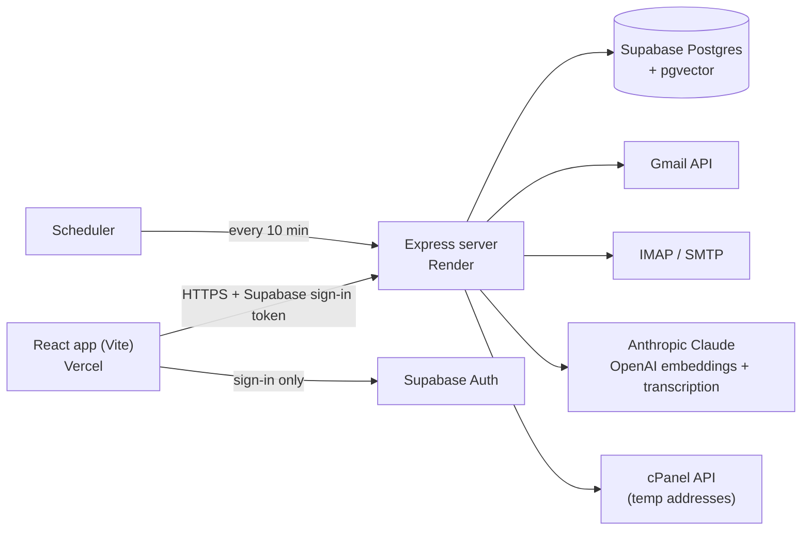

# Inbox Aggregator

Every email account in one inbox, with notes, an AI assistant, voice input,
undo send, send later, and throwaway email addresses. A web app I designed and
built, and use every day on Windows (installed from the browser) and iPhone
(added to the home screen).

Live at [inbox.aaroncheung.me](https://inbox.aaroncheung.me) (personal use;
sign-ups are closed).

## What it does

- **One inbox for Gmail and any IMAP mailbox**, synced in the background and on
  demand, with per-account colors, Received and Sent, pinned emails and
  Outlook-style conversations that hide the quoted copies replies carry.
- **Email shown as sent**, in a locked-down frame: no scripts, images from the
  web only when allowed, wide newsletters scaled to fit a phone.
- **Search** with Gmail-style operators (`from:`, `after:`, `has:attachment`),
  and an **AI assistant** that searches and reads your email, attachments
  (PDFs, scans, images) and notes, answers with numbered sources, and can write
  notes or draft the email you're writing.
- **Notes** with reminders, pins, links to emails and other notes, drag to
  reorder, and an AI save that tidies a quick note or researches a topic in
  your email. Anything the AI adds is marked and can be undone.
- **Writing email**: reply, reply all, forward with attachments, signatures,
  a 15-second undo, and Send later.
- **Temp addresses**: throwaway addresses on my own domain that delete
  themselves, and the email they received, when they expire.
- **Voice input** for asking and noting, and browser-style tabs on desktop
  with an email shown beside the one being written.

## How it's built



The browser only signs in through Supabase; every piece of data goes through
the server, which checks the user's token on each request. Some details I'm
pleased with:

- **Provider-neutral sync.** Each provider has a connector that returns the
  same message shape. Gmail syncs incrementally through its History API; IMAP
  tracks the last UID seen per folder (and its UIDVALIDITY), so each sync
  fetches only what's new, and only the start of each message.
- **Hybrid search.** Postgres full-text search and pgvector similarity (HNSW
  index) run side by side, merged with reciprocal rank fusion, then nudged
  toward personal and transactional email and away from marketing.
- **The assistant** is a capped Claude tool loop (search, read email, read
  attachment, search notes, create note, write draft) streamed to the app as
  newline-delimited JSON, so progress and the answer appear as they're
  worked out. Citations are checked against what it actually saw, so it can't
  cite an email it made up. Prompt caching keeps follow-up questions cheap.
- **Undo send and Send later** share an outbox table: a timer sends each email
  when it's due, and a single conditional update (waiting to sending) is the
  claim, so a restart's catch-up can never send an email twice.
- **Security**: account credentials are encrypted (AES-256-GCM) before they're
  stored; the database has row-level security on and no policies, so only the
  server can read it; email HTML is sanitized (DOMPurify) and shown in a
  sandboxed frame with a strict content security policy; mail servers on
  private networks are refused, so the "connect a mailbox" form can't be used
  to probe the server's network.

**Stack:** React 19 and Vite (plain JavaScript), Express 5 on Node 22,
Supabase (Postgres, pgvector, Auth, Storage), Claude Haiku 4.5, OpenAI
`text-embedding-3-small` and `gpt-4o-mini-transcribe`, imapflow, nodemailer.

## Repository layout

```
inbox-aggregator/           the web app
  src/features/             one folder per feature (email, compose, notes,
                            assistant, accounts, settings, auth)
  src/shell/                the two panes, tabs and navigation
  src/ui/, src/hooks/       pieces several features share
inbox-aggregator-server/    the API server
  routes/                   one router per feature, kept thin
  lib/                      the logic: sync, search, assistant, outbox...
  connectors/               Gmail and IMAP behind one interface
  schema.sql                the whole database, for a new setup
  migrations/               how the original database got there
site/privacy.html           the privacy policy Google's sign-in links to
```

## Running it yourself

You'll need Node 22, a [Supabase](https://supabase.com) project, a Google Cloud
OAuth client for Gmail, and API keys from Anthropic and OpenAI.

1. **Database.** In the Supabase SQL Editor, run
   [`inbox-aggregator-server/schema.sql`](inbox-aggregator-server/schema.sql).
   Then create your user under Authentication > Users (sign-ups from the app
   are turned off). To sign in with a code as well as a link (needed for an
   iPhone home-screen app), add `{{ .Token }}` to the Magic Link email template.
2. **Gmail.** In Google Cloud, enable the Gmail API and make an OAuth client
   (web application) with the scopes `gmail.readonly`, `gmail.send` and
   `userinfo.email`, and the redirect URI
   `http://localhost:3001/auth/callback`. While the OAuth app is in testing,
   add your Gmail address as a test user. Other mailboxes connect over IMAP
   with no setup.
3. **Server.**
   ```
   cd inbox-aggregator-server
   cp .env.example .env      # then fill it in; each setting is explained there
   npm install
   npm start                 # http://localhost:3001
   ```
4. **App.**
   ```
   cd inbox-aggregator
   cp .env.example .env.local
   npm install
   npm run dev               # http://localhost:5173
   ```
5. **Background sync (optional).** Have a scheduler POST `/cron/sync` every
   10 minutes with the `X-Cron-Secret` header. It also sends overdue scheduled
   email and removes expired temp addresses. The app also syncs when opened.

Deployed, the app runs on Vercel (root `inbox-aggregator`) and the server on
Render (root `inbox-aggregator-server`, health check `/health`), each with the
same settings as its `.env.example`.

Before committing: `npx eslint src` and `npx vite build` in the app, and
`../inbox-aggregator/node_modules/.bin/eslint .` in the server.

## License

All rights reserved. The code is public to read; please don't reuse it
without asking.
